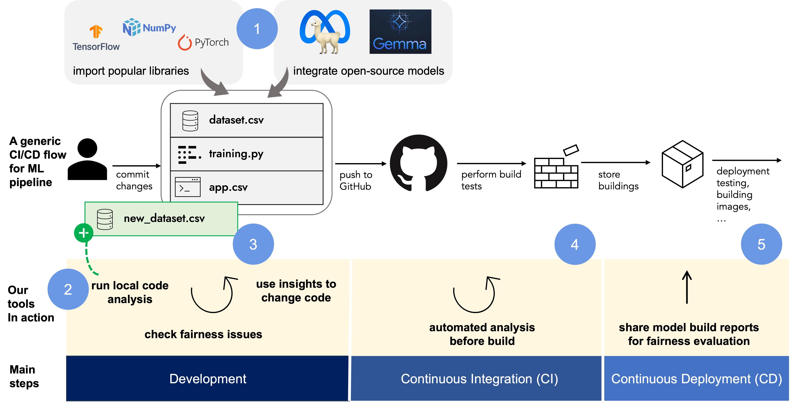

# Proactive Monitoring of AI Fairness

The project aims to enable a proactive fairness review approach in the early stages of AI development. It provides developer-oriented methods and tools to self-assess and monitor fairness. In this repository, we present a high level overview and project outputs.

## Developing a Monitoring/Logging Tool

> **Visit the tool dev page:** <https://github.com/asabuncuoglu13/faid> (Currently a private repo, will be released on November.)

Incorporating interpretability and fairness into the ML development process requires the development team to manage insights from various tools and processes. Effectively utilizing information on model behavior and output disparities can enhance overall system fairness throughout the ML lifecycle by (1) providing insights into how features influence outcomes, (2) making model decisions understandable, (3) ensuring models meet fairness criteria, and (4) supporting informed decision-making. However, it's essential to recognize the limitations of current methods and to use them alongside other fairness-enhancing strategies, rather than as standalone solutions.

FAID (Fair AI Development) can support developers in documenting fairness-related information, which is crucial to ensure transparency and accountability in the development process. FAID’s logging framework supports comprehensive documentation by categorizing information into four key entities:

1. **Experiment-Level Fairness Log**: Tracks high-level fairness considerations across the entire system, ensuring that all components align with the overarching fairness objectives.
2. **Model Log**: Captures detailed information about model performance, including fairness metrics, bias assessments, and adjustments made during the development process. FAID's model metadata logging capability follows Google's model metadata format. For instance, their open-source LLM model, Gemma 2, is documented here: <https://ai.google.dev/gemma/docs/model_card_2>. The model card includes an "Ethics and Safety" section with benchmark scores from nine dataset evaluations.
3. **Data Log**: Documents the data sources, preprocessing steps, and any biases identified in the data, ensuring that data integrity is maintained throughout the lifecycle.
4. **Risk Log**: Records potential risks related to fairness and how they are mitigated, including any ethical concerns, compliance issues, and the steps taken to address them.

## Testing Fairness Evaluation and Mitigation Techniques

We selected a set of evaluation and mitigation strategies that can inform the design of the “fairness rules”. Data and algorithm related techniques are selected from Gallegos et al.’s [^1] comprehensive survey. The selected techniques for data, algorithm and interaction components are following:

### Data Experiments

1.  **Counterfactual input techniques (evaluation):** By modifying the features of existing instances generate counterfactual instances. Use new instances to enhance the generalization of the model.
2.  **Prompt-based strategies (evaluation):** It includes sentence completions and question-answering tasks. We can measure co-occurrence patterns for generated output.
3.  **Data balancing/augmentation techniques (mitigation):** Increase the diversity of the training dataset by introducing synthetic samples or applying transformation techniques.
4.  **Projection-based techniques (mitigation):** As part of the pre-processing, transforming learned representations in the embedding space can augment balancing before the learning process.

### Algorithm Experiments

1. **Embedding-based metrics (evaluation):** Actively monitoring word or sentence level embeddings and computing the distances between certain groups.
2. **Probability based metrics (evaluation):** These metrics include comparing the next-token probabilities or likelihoods between sentences.
3. **Architecture modification technique (mitigation):** Changing the architecture configuration or including new layers for de-biasing can dynamically guide models to learn fair representations.
4. **Analysing modular debiasing networks (mitigation):** Modular networks can work as abstract models that can work stand-alone independent of the architecture configurations.

> **Visit FinBERT Sentiment Analysis Fairness Evaluation repository:** <https://github.com/asabuncuoglu13/faid-test-financial-sentiment-analysis>

### Interaction Method Analysis

1. **ISO 9241 Ergonomics of human-systems interactions to assess interfaces/interactions:** The comprehensive framework aims to assess usability and apply it to interactive system design. Providing insights related to design considerations will support our proactive fairness “by design” approach.
2. **Microsoft Human-AI Interaction to assess interfaces/interactions:** It is a structured thinking process to design AI-powered applications.

> **See an example analysis here:** <https://asabuncuoglu13.github.io/equitable-ai-cookbook/usecases/finance/interaction.html>

## Tutorials and Learning Resources

1. [Equitable AI Cookbook](https://asabuncuoglu13.github.io/equitable-ai-cookbook): We started a new open-source community around Equitable AI Cookbook. You can find background information, experiment results, findings and discussion. See all the information and suggested reading to improve fairness in financial LLMs.
2. [Using LLMs on Local, HPC and Cloud](https://github.com/alan-turing-institute/llms-useful-resources): In collaboration with the [REG team](https://www.turing.ac.uk/work-turing/research/research-engineering-group), useful scripts and guidelines to set up LLMs.

[^1]: I. O. Gallegos et al., ‘Bias and Fairness in Large Language Models: A Survey’. arXiv, Sep. 01, 2023. Accessed: Oct. 17, 2023. [Online]. Available: http://arxiv.org/abs/2309.00770 

## Funding Information

This project is one of the four projects funded in the [Fairness Innovation Challenge](https://fairnessinnovationchallenge.co.uk/#winners), delivered by the Department for Science, Innovation and Technology (DSIT), and Innovate UK, in partnership with The EHRC and The ICO. 