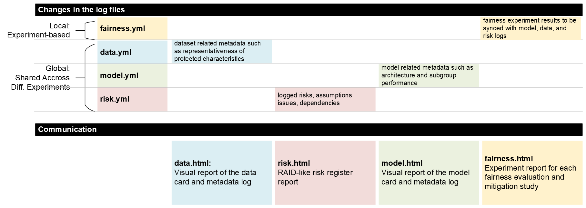

# Proactive Monitoring of AI Fairness

The project aims to enable a proactive fairness review approach in the early stages of AI development. It provides developer-oriented methods and tools to self-assess and monitor fairness. In this repository, we present a high level overview and list project outputs.

## Monitoring Fairness Metadata

> **Visit the tool dev page:** <https://github.com/asabuncuoglu13/faid>

Throughout the development of ML models, developers and other stakeholders use various documentation formats to enhance reproducibility and communicate the details of artefacts with both internal and external stakeholders. Organizations use metadata recording formats, such as model cards, data cards, and algorithmic transparency frameworks to improve transparency across development and deployment workflows. We refer to these documentation tools as "transparency artefacts," which are designed to enhance clarity, accountability, and trust in ML systems. We are developing a tool for effectively using these transparency artefacts as justified evidence to verify the team took the required actions and created enough evidence for the claimed fairness arguments.

This "justified evidence" approach can enhance overall system fairness throughout the ML lifecycle by (1) providing insights into how features influence outcomes, (2) making model decisions understandable, (3) ensuring models meet fairness criteria, and (4) supporting informed decision-making. However, it's essential to recognise the limitations of current methods and to use them alongside other fairness-enhancing strategies, rather than as standalone solutions.

**An overview of ML project lifecycle with CI/CD:**

**An overview of metadata flow throughout this lifecycle:**

The tool, FAID (Fair AI Development), can support developers in documenting fairness-related information, which is crucial to ensure transparency and accountability in the development process. FAID’s logging framework supports comprehensive documentation by categorizing information into four key entities:

1. **Experiment-Level Fairness Log**: Tracks high-level fairness considerations across the entire system, ensuring that all components align with the overarching fairness objectives.
2. **Model Log**: Captures detailed information about model performance, including fairness metrics, bias assessments, and adjustments made during the development process. FAID's model metadata logging capability follows Google's model metadata format (See an [example model card](https://ai.google.dev/gemma/docs/model_card_2)).
3. **Data Log**: Documents the data sources, preprocessing steps, and any biases identified in the data, ensuring that data integrity is maintained throughout the lifecycle. (See an [example datasheet]()).
4. **Risk Log**: Records potential risks related to fairness and how they are mitigated, including any ethical concerns, compliance issues, and the steps taken to address them.

## Fairness Evaluation of a Finance Use Case

We selected a set of evaluation and mitigation strategies that can inform the design of the tool. Data and algorithm related techniques are selected from Gallegos et al.’s [^1] comprehensive survey.

> **Visit FinBERT Sentiment Analysis Fairness Evaluation repository:** <https://github.com/asabuncuoglu13/faid-test-financial-sentiment-analysis>

## Understanding equitable interaction

We utilised ISO 9241 (Ergonomics of human-systems interactions), and Microsoft's Human-AI Interaction Guideline to assess how existing interactions can impact the overall fairness of the system.

> **See an example analysis here:** <https://asabuncuoglu13.github.io/equitable-ai-cookbook/usecases/finance/interaction.html>

## Tutorials and Learning Resources

1. [Equitable AI Cookbook](https://asabuncuoglu13.github.io/equitable-ai-cookbook): We started a new open-source community around Equitable AI Cookbook. You can find background information, experiment results, findings and discussion. See all the information and suggested reading to improve fairness in financial LLMs.
2. [Using LLMs on Local, HPC and Cloud](https://github.com/alan-turing-institute/llms-useful-resources): In collaboration with the [REG team](https://www.turing.ac.uk/work-turing/research/research-engineering-group), useful scripts and guidelines to set up LLMs.

[^1]: I. O. Gallegos et al., ‘Bias and Fairness in Large Language Models: A Survey’. arXiv, Sep. 01, 2023. Accessed: Oct. 17, 2023. [Online]. Available: http://arxiv.org/abs/2309.00770 

## Funding Information

This project is one of the four projects funded in the [Fairness Innovation Challenge](https://fairnessinnovationchallenge.co.uk/#winners), delivered by the Department for Science, Innovation and Technology (DSIT), and Innovate UK, in partnership with The EHRC and The ICO. 