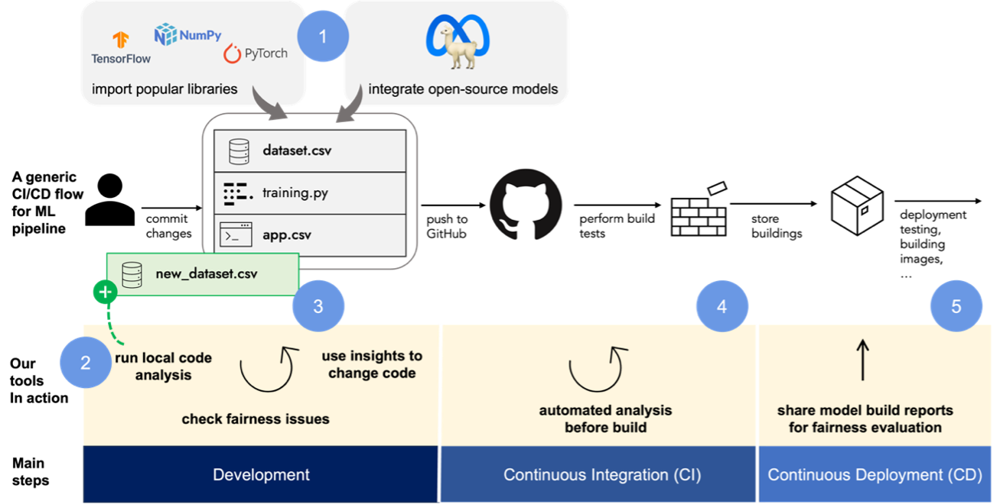

# Proactive Monitoring of AI Fairness

The project aims to enable a proactive fairness review approach in the early stages of AI development. It provides developer-oriented methods and tools to self-assess and monitor fairness.

## Stage 1: Testing Fairness Evaluation and Mitigation Techniques

We selected a set of evaluation and mitigation strategies that can inform the design of the “fairness rules”. Data and algorithm related techniques are selected from Gallegos et al.’s [^1] comprehensive survey. The selected techniques for data, algorithm and interaction components are following:

### Data Experiments

1.  **Counterfactual input techniques (evaluation):** By modifying the features of existing instances generate counterfactual instances. Use new instances to enhance the generalization of the model.
2.  **Prompt-based strategies (evaluation):** It includes sentence completions and question-answering tasks. We can measure co-occurrence patterns for generated output.
3.  **Data balancing/augmentation techniques (mitigation):** Increase the diversity of the training dataset by introducing synthetic samples or applying transformation techniques.
4.  **Projection-based techniques (mitigation):** As part of the pre-processing, transforming learned representations in the embedding space can augment balancing before the learning process.

### Algorithm Experiments

1. **Embedding-based metrics (evaluation):** Actively monitoring word or sentence level embeddings and computing the distances between certain groups.
2. **Probability based metrics (evaluation):** These metrics include comparing the next-token probabilities or likelihoods between sentences.
3. **Architecture modification technique (mitigation):**Changing the architecture configuration or including new layers for de-biasing can dynamically guide models to learn fair representations.
4. **Analysing modular debiasing networks (mitigation):** Modular networks can work as abstract models that can work stand-alone independent of the architecture configurations.

### Interaction Method Analysis

1. **ISO 9241 Ergonomics of human-systems interactions to assess interfaces/interactions:** The comprehensive framework aims to assess usability and apply it to interactive system design. Providing insights related to design considerations will support our proactive fairness “by design” approach.
2. **Microsoft Human-AI Interaction to assess interfaces/interactions:** It is a structured thinking process to design AI-powered applications.

## Stage 2: Developing a CI/CD Tool

Imagine a scenario, where an AI vendor specializing in insurance decision-making endeavours to develop an LLM-powered tool for anticipating future insurance cases based on historical data. Out tool in a CI/CD flow can help them in the following steps:

1.	The vendor strategically opts for an open-source language model and integrates select open-source repositories, laying the groundwork for a comprehensive solution. After the initial commit, our tool can list known issues with the model.
2.	When the development team introduces a new dataset, upon the creation of a new codebase version incorporating this dataset, our tool can autonomously identify fairness issues in adherence to our defined "fairness rules." Recognizing the dataset as historical, the tool systematically pinpoints and addresses historical bias issues.
3.	Developers gain visibility into detected issues and receive actionable insights within an intuitive Graphical User Interface (GUI). The GUI strategically displays possible mitigations, aligning them with practical "design patterns" to empower developers in maintaining code integrity for subsequent cases.
4.	As the tool is integrated into the development pipeline via GitHub Actions, ongoing monitoring ensures that new datasets and code changes are consistently evaluated for fairness before building the store version.
5.	The tool automatically generates documentation detailing the fairness assessments conducted, the detected issues, and the implemented mitigations. This documentation serves as a transparent record of the fairness efforts undertaken, aiding in accountability and compliance.

[^1] I. O. Gallegos et al., ‘Bias and Fairness in Large Language Models: A Survey’. arXiv, Sep. 01, 2023. Accessed: Oct. 17, 2023. [Online]. Available: http://arxiv.org/abs/2309.00770 