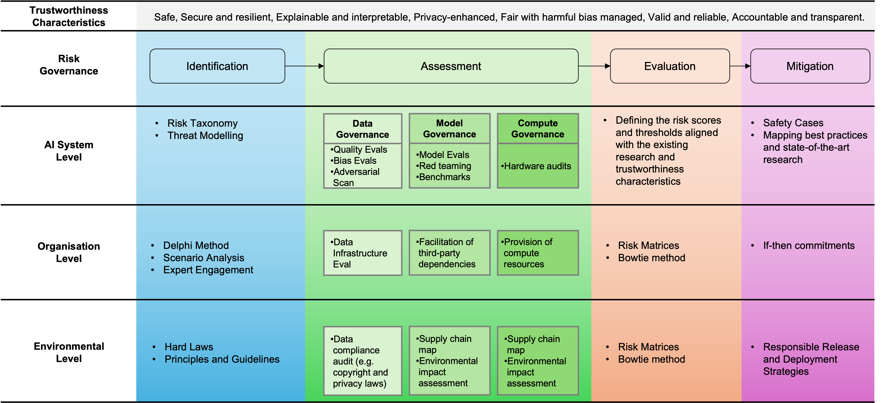

# Mapping the Skill Requirements

Based on the workshop findings, latest reports, and our experiments during this project, this document identifies the skill requirements for achieving a fairness-orinted AI lifecycle.

## A Risk-based Approach

Effective project mapping starts with a solid foundation—risk management. By taking a risk-based approach, enterprises can streamline their project management, aligning it with established risk frameworks. Following this principle, we adopt the risk management process outlined in the latest [International AI Safety Report (2025)](https://www.gov.uk/government/publications/international-ai-safety-report-2025). The report defines a structured approach encompassing risk identification, evaluation, assessment, and mitigation, all underpinned by strong governance.

1. **Risk Identification**  
   - Recognizing bias and fairness risks in AI models  
   - Understanding ethical AI principles and compliance  
   - Awareness of societal and organizational impacts of AI  

2. **Risk Evaluation & Assessment**  
   - Assessing data quality, biases, and provenance  
   - Applying governance frameworks for responsible AI  
   - Understanding AI explainability and transparency  

3. **Risk Mitigation**  
   - Implementing fairness-aware model evaluation techniques  
   - Establishing accountability and documentation practices  
   - Ensuring alignment with regulatory and ethical standards  

The figure below provides an overview of recommended tools and techniques to support the risk management process.  

  

Once practitioners identify fairness-related needs in their AI lifecycle, they should ask: **"Which skills does our organization lack that prevent us from effectively applying these techniques?"**

## Skills Required for a Fairness-Oriented AI Lifecycle

The _AI Skills for Business Competency Framework_, developed by The Alan Turing Institute, outlines the key AI skills and competencies required to support AI adoption in businesses. It aims to help employers, employees, and training providers address AI-related skill gaps.  

The framework is structured into five dimensions that align with different phases of the AI lifecycle:  
- **Dimension A: Privacy and Stewardship** – Ensuring data protection, security, and governance.  
- **Dimension B: Specification, Acquisition, Engineering, Architecture, Storage, and Curation** – Managing data collection, engineering, and deployment.  
- **Dimension C: Problem Definition and Communication** – Framing AI problems and effectively communicating findings.  
- **Dimension D: Problem Solving, Analysis, Modelling, and Visualization** – Applying data science and AI techniques to solve problems.  
- **Dimension E: Evaluation and Reflection** – Assessing AI models, ensuring ethical use, and promoting responsible AI practices.  

The framework defines four key personas based on AI expertise and responsibilities:  
- **AI Citizens** – General public and AI users with basic awareness.  
- **AI Workers** – Employees using AI tools in their roles.  
- **AI Professionals** – Specialists responsible for AI development and deployment.  
- **AI Leaders** – Decision-makers overseeing AI governance and strategy.  

The framework serves as a guide for businesses to identify skill gaps, develop training strategies, and align AI competencies with workforce needs. It can be used by employers for upskilling, by employees for career development, and by training providers to design targeted AI education programs. **We used the framework to align fairness-related needs with overall AI maturity needs:**

- **Dimension A: Privacy and Stewardship**  
  - Ensuring fairness in data collection and processing
  - Managing sensitive data without introducing bias

- **Dimension C: Problem Definition and Communication**  
  - Communicating AI fairness risks to non-technical stakeholders
  - Defining AI governance policies for fairness and inclusivity

- **Dimension D: Problem Solving, Analysis, Modelling, Visualization**  
  - Applying bias mitigation strategies in AI models
  - Evaluating fairness across different demographic groups

- **Dimension E: Evaluation and Reflection**  
  - Embedding fairness in AI auditing and governance
  - Monitoring AI fairness risks throughout the lifecycle

**Potential Key Gaps**
- AI Leaders lack expertise in fairness-oriented governance.
- AI Professionals need better skills in fairness-aware model building and feature engineering.
- AI Workers need awareness of fairness implications in AI use.

## Checklist for Organisations

**Assess Current AI Fairness Maturity**
- [ ] Review existing AI systems for bias, transparency, and ethical considerations.  
- [ ] Evaluate which fairness-related skills are missing across different roles (AI Workers, Professionals, Leaders).  
- [ ] Compare internal capabilities with best practices in fairness-aware AI.  

**Define Fairness Goals and Competency Requirements**
- [ ] Define fairness objectives aligned with ethical and regulatory requirements.  
- [ ] Map competencies to roles:  
   - **AI Workers** → Awareness of fairness implications in AI tools.  
   - **AI Professionals** → Bias mitigation techniques, explainability, and fairness-aware model design.  
   - **AI Leaders** → Governance, legal compliance, and strategic risk management.  

**Implement Targeted Training Programs**
- [ ] Awareness training, focusing on **AI workers** and general staff: AI ethics, fairness risks, and the impact of bias. Recognizing fairness challenges in AI applications.  
- [ ] Technical training, focusing on **AI Professionals**: Fairness-aware data preprocessing and model evaluation. Bias detection tools (e.g., Fairlearn, AIF360). Explainability techniques and regulatory compliance.  
- [ ] Leadership and governance training, focusing on **AI Leaders**: AI fairness policy development and accountability. Regulatory considerations. Risk mitigation frameworks and governance frameworks.  

**Integrate Fairness into AI Development and Governance**
- [ ] Embed fairness principles into AI lifecycle processes (data collection, model building, deployment, and monitoring).  
- [ ] Develop checklists and guidelines for fairness assessment.  
- [ ] Establish a cross-functional AI ethics committee for ongoing oversight.  
- [ ] Conduct regular fairness audits using defined metrics.  
- [ ] Gather feedback from stakeholders to refine fairness strategies.  
- [ ] Continuously update skills and policies to align with evolving regulations and best practices.